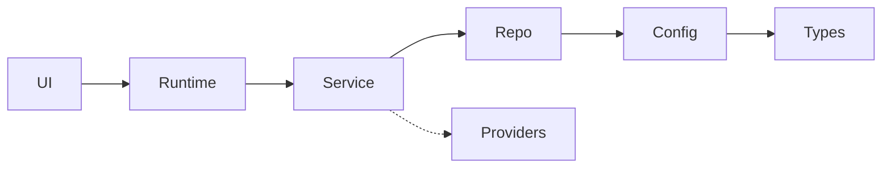

# File templates

Concrete shape for each file this skill produces. Fill in with information harvested from the codebase in Phases 1–2. Do not copy the templates verbatim — they are *shape*, not *content*.

All templates use English as the default. If the repo's existing docs are in another language, write these in the same language. Code identifiers stay in their original form.

---

## `AGENTS.md`

```markdown
# Agent guide

<One paragraph: what this repo is, who uses it, runtime shape in 2-3 lines.>

## Start here

| If you want to... | Read... |
|---|---|
| Understand the overall architecture | `ARCHITECTURE.md` |
| Understand why we made a design decision | `docs/design-docs/index.md` |
| Find an active plan | `docs/PLANS.md` |
| Check quality / known gaps | `docs/QUALITY_SCORE.md` |
| Look up an external library | `docs/references/` |
| See product flows | `docs/product-specs/index.md` |

## Repository layout

- `<src-dir>/` — <one line>
- `<tests-dir>/` — <one line>
- `docs/` — system of record; see index below
- <other top-level dirs>

## Core invariants

<Max 5 bullets. Things that must always be true. Each bullet is one line.>

- Dependency direction: <X → Y → Z>; never the reverse
- All data crossing a boundary is parsed (library is your choice)
- Public APIs are versioned via <mechanism>
- <etc.>

For *why* these exist, see `docs/design-docs/core-beliefs.md`.

## docs/ index

- `design-docs/` — design decisions with verification status
- `exec-plans/` — active and completed plans, plus `tech-debt-tracker.md`
- `product-specs/` — user-facing flows
- `references/` — external library reference material
- `generated/` — auto-generated; do not edit
- `DESIGN.md`, `FRONTEND.md`, `QUALITY_SCORE.md`, `PLANS.md`, `PRODUCT_SENSE.md`

## How to work in this repo

1. Read the relevant design doc before changing behavior.
2. Update the design doc's `Last reviewed` date when you touch related code.
3. Check in plans under `docs/exec-plans/active/` for any multi-step work.
4. Open PRs against `main`; keep them small.
```

**Budget check:** this template comes in around 50 lines. The filled-in version should stay under ~120. If it grows past that, you are putting conventions here that belong in `docs/`.

---

## `ARCHITECTURE.md`

```markdown
# Architecture

## At a glance

<2–4 sentences: what kind of system, what the runtime looks like, how requests flow at a high level.>

## Domains

Business domains in this system:

- **<domain-1>** — <one line>. Code: `<src/...>`. Docs: `<docs/...>`.
- **<domain-2>** — ...

## Layers

Each domain is divided into these layers. Dependencies flow **only** in the direction shown.

```
Types → Config → Repo → Service → Runtime → UI
```

(Adapt to what the code actually enforces. If nothing is enforced yet, write "Observed layers" and note that enforcement is a tech-debt item.)

| Layer | Responsibility | Example |
|---|---|---|
| Types | Schemas, domain types | `src/auth/types.ts` |
| Config | Static config, feature flags scoped to domain | `src/auth/config.ts` |
| Repo | Data access | `src/auth/repo.ts` |
| Service | Business logic | `src/auth/service.ts` |
| Runtime | Wiring, startup | `src/auth/runtime.ts` |
| UI | User-facing surface | `src/auth/ui/` |

## Cross-cutting providers

Any concern shared across domains goes through an explicit provider:

- **Auth provider** — <file>
- **Telemetry provider** — <file>
- **Feature-flag provider** — <file>
- **Connector registry** — <file>

Domains call providers, not each other.

## Diagram



## Known violations

Places the architecture is currently broken. See `docs/exec-plans/tech-debt-tracker.md` for the full list.

- <item>
- <item>
```

---

## `docs/design-docs/index.md`

```markdown
# Design docs

Each doc records a single design decision, its rationale, and its current status.

| Doc | Status | Last reviewed | Summary |
|---|---|---|---|
| [`core-beliefs.md`](core-beliefs.md) | verified | YYYY-MM-DD | Operating principles |
| [`<topic>.md`](<topic>.md) | draft / verified / deprecated | YYYY-MM-DD | <one line> |

## Status vocabulary

- **draft** — written but not yet reviewed or reflected in code
- **verified** — matches current code; last confirmed on the date shown
- **deprecated** — superseded or no longer true; linked to replacement

Any doc whose `Last reviewed` date is older than <N> days should be re-verified by a human or a gardener agent.
```

---

## `docs/design-docs/core-beliefs.md`

```markdown
# Core beliefs

Short, declarative statements about how we operate. These inform every other design decision. If a belief here conflicts with a specific design doc, the belief wins until the belief itself is updated.

Status: verified
Last reviewed: YYYY-MM-DD

## Engineering

- **Parse at the boundary.** All data entering the system is validated into a typed shape before being used. The library used is a choice per-domain.
- **Prefer shared utilities over bespoke helpers.** If three call sites need the same thing, it goes in `packages/util` (or equivalent).
- **No YOLO with data.** We either validate or use a typed SDK. We never trust untyped objects at runtime.
- **Small PRs.** Merge gates are minimal; iteration is cheap.

## Architecture

- **Dependency direction is one-way.** <Types → Config → Repo → Service → Runtime → UI>. Enforced via custom lint.
- **Cross-cutting concerns go through providers.** Domains do not import from each other.

## Documentation

- **The repo is the source of truth.** If knowledge lives outside the repo, it is invisible to agents. Encode it.
- **Docs are dated and verified.** Every design doc has a `Last reviewed` date. Stale docs are treated as bugs.

## Agents

- **Humans steer; agents execute.** Humans specify intent, design environments, and validate outcomes. Agents write, test, and review code.
- **When an agent struggles, fix the harness, not the prompt.** Missing tool? Add it. Missing doc? Write it. Unclear constraint? Make it mechanical.
```

(Adapt. Pull from existing docs and README if principles are already stated there.)

---

## `docs/exec-plans/tech-debt-tracker.md`

```markdown
# Tech debt

Known issues that should be addressed but are not currently blocking. Versioned with the repo so agents can reason about them.

Status: verified
Last reviewed: YYYY-MM-DD

## Open items

| ID | Item | Impact | Proposed fix | Notes |
|---|---|---|---|---|
| TD-001 | <observed issue> | low / med / high | <link to plan or proposal> | <date opened> |

## Resolved

| ID | Item | Resolved in |
|---|---|---|
| ... | ... | PR #... |

## Intake policy

When you encounter debt while working on something else: add an entry here, link to the relevant code location, and keep going. Do not inline-fix unrelated debt inside a feature PR.
```

(Seed with 3–10 items you noticed in Phase 1. Don't invent debt — write only what you observed.)

---

## `docs/exec-plans/active/README.md` (placeholder)

```markdown
# Active plans

Multi-step work in progress. One markdown file per plan, named `YYYY-MM-DD-<slug>.md`. Each plan has:

1. **Goal** — what we're trying to achieve.
2. **Steps** — checklist, updated as work progresses.
3. **Decisions** — choices made along the way and why.
4. **Owner** — human or agent responsible.

When complete, move to `../completed/`.
```

## `docs/exec-plans/completed/README.md` (placeholder)

```markdown
# Completed plans

Archive of finished plans, preserved so decisions and their rationale remain discoverable.

Do not edit completed plans; add a successor plan in `../active/` if something needs revisiting.
```

---

## `docs/product-specs/index.md`

```markdown
# Product specs

User-facing flows. Written from the user's perspective, not the implementation's.

| Spec | Status | Last reviewed | Summary |
|---|---|---|---|
| [`<flow>.md`](<flow>.md) | draft / verified | YYYY-MM-DD | <one line> |

Implementation details live in design docs, not here.
```

---

## `docs/generated/db-schema.md`

```markdown
# Database schema

> **DO NOT EDIT.** This file is auto-generated.
>
> Regenerate with: `<command>`
> Source: `<path-to-migrations-or-schema>`
> Last generated: YYYY-MM-DD

## Tables

<extracted from schema files, or left as placeholder if none found>
```

---

## `docs/DESIGN.md` (if UI exists)

```markdown
# Design

Visual and interaction design principles for the UI.

Status: verified
Last reviewed: YYYY-MM-DD

## Principles

- <principle>
- <principle>

## Tokens

- Colors: <source>
- Typography: <source>
- Spacing: <source>

## Component library

<link or path>

## Reference

Deep reference lives in `docs/references/design-system-reference-llms.txt`.
```

## `docs/FRONTEND.md` (if UI exists)

```markdown
# Frontend

Conventions for frontend code in this repo.

Status: verified
Last reviewed: YYYY-MM-DD

## Stack

- Framework: <e.g. React 19>
- State: <e.g. React Query + useReducer>
- Routing: <e.g. React Router 7>
- Styling: <e.g. CSS Modules, Tailwind>

## Structure

<Where components live, how they're organized per-domain.>

## Conventions

- Component files export a default and are named `PascalCase.tsx`.
- One component per file. Subcomponents used only locally live in the same file.
- Data fetching happens in <layer>; components are pure.
- <etc.>
```

---

## `docs/PLANS.md`

```markdown
# Plans

Index into `exec-plans/`.

## Active

<list of files in exec-plans/active/ with one-line summaries>

## Recently completed

<last 5–10 from exec-plans/completed/>

## Tech debt

See [`exec-plans/tech-debt-tracker.md`](exec-plans/tech-debt-tracker.md).
```

---

## `docs/PRODUCT_SENSE.md` (optional)

```markdown
# Product sense

The taste and principles that guide product decisions when there isn't a spec.

Status: verified
Last reviewed: YYYY-MM-DD

## Voice

<How the product speaks. Examples of in-voice vs out-of-voice copy.>

## Non-goals

<Things we've explicitly decided not to do, so nobody wastes time proposing them.>

## Trade-off defaults

- <When speed vs. polish is ambiguous, which wins?>
- <When simplicity vs. flexibility is ambiguous, which wins?>
```

---

## `docs/QUALITY_SCORE.md`

```markdown
# Quality score

Per-domain, per-layer quality assessment. Updated when domains change substantially. Used to prioritize refactor work.

Status: verified
Last reviewed: YYYY-MM-DD

## Grading

- **A** — well-typed, well-tested, matches its design doc, no known bugs.
- **B** — mostly solid, 1–2 known gaps.
- **C** — works but has significant tech debt or missing tests.
- **D** — fragile, should not be extended without a refactor plan.
- **—** — not applicable (domain doesn't have this layer).

## Scores

| Domain | Types | Config | Repo | Service | Runtime | UI |
|--------|-------|--------|------|---------|---------|-----|
| <domain> | A | B | B | C | — | — |

## Notes

<Per-domain commentary on what's driving the grade. Link to tech-debt-tracker items.>
```

---

## Headers for design docs

Every design doc under `docs/design-docs/<topic>.md` starts with:

```markdown
# <Topic>

Status: draft | verified | deprecated
Last reviewed: YYYY-MM-DD
Owner: <human or "team">

## Context

<What problem this addresses. 2–4 sentences.>

## Decision

<What we do. Concrete and specific.>

## Rationale

<Why. What was considered and rejected.>

## Consequences

<What this implies. Side effects, constraints, future work.>

## Related

- <Link to related design docs>
- <Link to code>
```

This is the standard ADR-style shape. Use it unchanged unless the repo already has a different ADR template in use.
